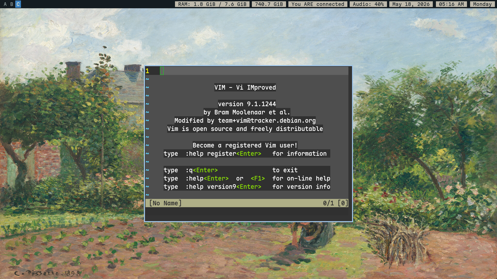

# homeguard



A set of configurations for linux-related stuff. Consists of scripts, [dotfiles](https://wiki.archlinux.org/title/Dotfiles), and many more to come.

> The "unmaintained" folder is my archived folder, it hasn't been used for a while so they may or may not work. They are not included in the script.

The only currently existing script that I have at the moment is for setting up i3wm with my own dotfiles. Install packages, imports my i3 config, so on and so forth.

> [!WARNING]
> Never paste a script without "you" knowing what it does. It's important to check a script before trying on executing it on your system. I am not responsible for any possible system breakages that can occur. This is a personal and more of a hobby setup. Always proceed with caution.

```
bash <(wget -qO- https://raw.githubusercontent.com/jgz365/homeguard/main/scripts/setup.sh)
```
```
Usage: setup.sh [options]

e.g bash <(wget -qO- https://raw.githubusercontent.com/jgz365/homeguard/main/scripts/setup.sh) --verbose

Options:
  --no-nvidia             Skip NVIDIA driver installation (only if your driver doesn't support NVIDIA >= 550)
  --verbose               Show detailed output during installation
  -h, --help              Show this help message

Examples:
  setup.sh                          # Default
  setup.sh --no-nvidia              # Skip NVIDIA installation
  setup.sh --verbose                # Show output
  setup.sh --no-nvidia --verbose    # Skip NVIDIA, show output
```

Checklist:

Complete: 

- [x] Create the repository
- [x] Add configuration files 
- [x] Add some old configs from my private repos

Script:

- [x] Create an install script
- [x] Include vim configuration 
- [x] Include my dotfiles
- [x] Add an option for NVIDIA Driver installation
- [x] Add my configuration file for Ghostty
- [x] Import a fastfetch preset from the wiki
- [x] Import my configuration file for dunst
- [x] Import my picom config
- [x] Add my custom bash prompt that detects system age
- [x] Script re-write - much better
- [x] Better package cleaup (remove package Y pulled by package X) - solved with `--no-install-recommends`

Incomplete/In Progress:

- [ ] Import settings.ini for automatic GTK Theming
- [ ] Simple LSP + Syntax Highlighting for Vim, primarily for C Language
- [ ] Test the script

Scrapped:

~~-Add an option to make NVIDIA as the primary gpu (for optimus laptops)~~ 

~~Add a logfile(?)~~ unnecessary.

# Using NVIDIA as the Primary GPU (only tested in i3wm)

There's a little workaround to do for this to work. <br>
If by any chance you *want* to make this happen, [here's how](https://wiki.debian.org/NVIDIA%20Optimus#Using_NVIDIA_GPU_as_the_primary_GPU):

The script already installs `x11-xserver-utils`

1. Paste the following in `/etc/X11/xorg.conf`
```
Section "ServerLayout"
    Identifier "layout"
    Screen 0 "nvidia"
    Inactive "intel"
EndSection

Section "Device"
    Identifier "nvidia"
    Driver "nvidia"
    BusID "PCI:x:x:x"
EndSection

Section "Screen"
    Identifier "nvidia"
    Device "nvidia"
    Option "AllowEmptyInitialConfiguration"
EndSection

Section "Device"
    Identifier "intel"
    Driver "modesetting"
    BusID "PCI:x:x:x"
EndSection

Section "Screen"
    Identifier "intel"
    Device "intel"
EndSection
```
2. `PCI:x:x:x` consists of three numbers. Get the output from `lspci`. Since this is Optimus, it uses Intel x NVIDIA. Note of the following:

`00:02.0 VGA compatible controller: Intel Corporation Haswell-ULT Integrated Graphics Controller (rev 09)`

This is Intel's Graphics. `00:02.0` is translated to `PCI:0:2:0`.

`04:00.0 3D controller: NVIDIA Corporation GM108M [GeForce 840M] (rev a2)`

This is NVIDIA's Graphics. `04:00.0` is translated to `PCI:4:0:0`.

> [!NOTE]
> This can differ depending on your hardware. This is only a sample from my system.

3. Place the following in `~/.xinitrc`:

> This is where things are different, as per the Wiki, you are recommended to put this in `~/.xsessionrc`, upon trying this method, i3wm refuses to launch.

The order in here ***MATTERS***, if you try adding `exec dbus-run-session i3` on top, i3wm will not launch.

```
xrandr --setprovideroutputsource modesetting NVIDIA-0
xrandr --auto
xrandr --dpi 96
exec dbus-run-session i3
```

4. Specify PrimaryGPU to be NVIDIA, paste in `/etc/X11/xorg.conf.d/nvidia_as_primary.conf`
```
Section "OutputClass"
    Identifier "nvidia"
    MatchDriver "nvidia-drm"
    Driver "nvidia"
    Option "PrimaryGPU" "yes"
EndSection
```

5. In `/etc/default/grub`, add the following in `GRUB_CMDLINE_LINUX_DEFAULT`:
```
nvidia-drm.modeset=1
```
6. Rebuild the configuration with `sudo update-grub`

### Optional: PRIME Sync over picom

Instead of picom handling screen tearing, you can use PRIME's VSync instead. 
> saves you about 1 package less, nothing special really.

1. Add at the *very bottom of `/etc/modprobe.d/nvidia.conf`:
```
options nvidia-drm modeset=1
```

2. Regenerate your initramfs:
```
# update-initramfs -u
```

Reboot, then invoke `startx`. i3wm should launch.<br>
If by any chance you have or use a login manager, follow the [wiki](https://wiki.debian.org/NVIDIA%20Optimus#Display_managers) for more instructions.

> The reason I did *NOT add this onto my script, is because it can get too complex, and can be tedious to work with. I do not plan to make big configurations here anymore, as it is nothing but an install script. 

Sources used:
- [i3-starterpack](https://github.com/addy-dclxvi/i3-starterpack)
- [C. Pissarro Artworks](https://www.wikiart.org/en/camille-pissarro)
- [Gentoo Wiki - i3wm](https://wiki.gentoo.org/wiki/I3)
- [Debian Packages](https://www.debian.org/distrib/packages)
- [NVIDIA Graphics Drivers](https://wiki.debian.org/NvidiaGraphicsDrivers)
- [This stackoverflow question](https://stackoverflow.com/questions/40986340/how-to-wget-a-list-of-urls-in-a-text-file)
- [CTT's Debian-titus script](https://github.com/ChrisTitusTech/Debian-titus/blob/main/install.sh)
- [Bash Git Prompt](https://github.com/magicmonty/bash-git-prompt)
- [Bash Syntax](https://www.w3schools.com/bash/bash_syntax.php)
- [Fastfetch](https://github.com/fastfetch-cli/fastfetch)

