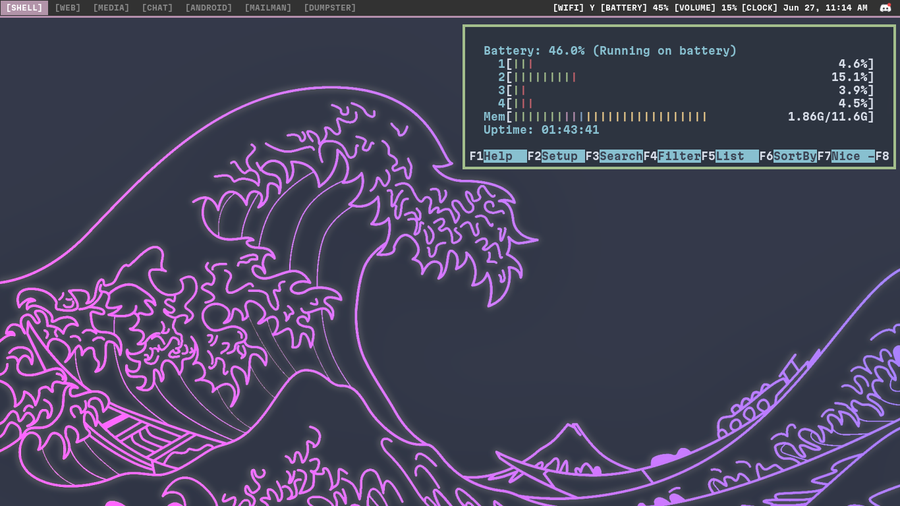
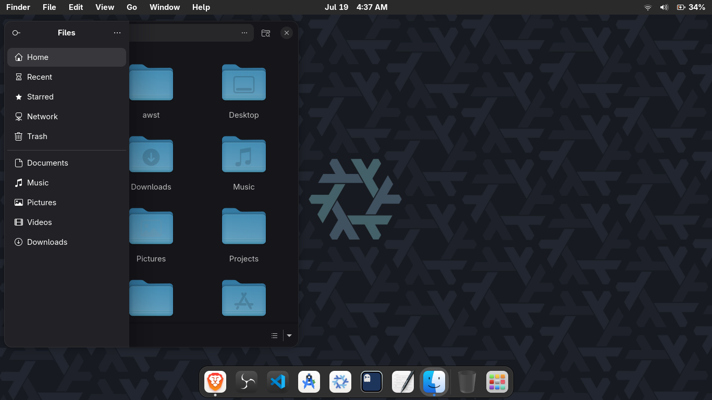

## My personal set of configurations for linux-related stuff.

<table border="0">
  <tr>
    <td>
       
      <b>SwayWM with Debian </b>
    </td>
    <td>
       
      <b>i3wm with Gentoo</b>
    </td>
    <td>
       
      <b>NixOS with GNOME</b>
    </td>
  </tr>
</table>

### I've listed some documentation or things that I have used on their respective folders.  
### Check here for [[epoch]](./epoch) and [[deborah]](./deborah)

#### Just in: I am now using NixOS, so documentation for Nix will be added soon.

> The "unmaintained" folder is my archived folder, it hasn't been used for a while so they may or may not work.

Sources used:
- [i3-starterpack](https://github.com/addy-dclxvi/i3-starterpack)
- [C. Pissarro Artworks](https://www.wikiart.org/en/camille-pissarro)
- [Gentoo Wiki - i3wm](https://wiki.gentoo.org/wiki/I3)
- [Debian Packages](https://www.debian.org/distrib/packages)
- [NVIDIA Graphics Drivers](https://wiki.debian.org/NvidiaGraphicsDrivers)
- [This stackoverflow question](https://stackoverflow.com/questions/40986340/how-to-wget-a-list-of-urls-in-a-text-file)
- [CTT's Debian-titus script](https://github.com/ChrisTitusTech/Debian-titus/blob/main/install.sh)
- [Bash Git Prompt](https://github.com/magicmonty/bash-git-prompt)
- [Bash Syntax](https://www.w3schools.com/bash/bash_syntax.php)
- [Fastfetch](https://github.com/fastfetch-cli/fastfetch)
- [Arc-Theme](https://github.com/arc-design/arc-theme)
- [NixOS Official Wiki](https://wiki.nixos.org/wiki/NixOS_Wiki)
