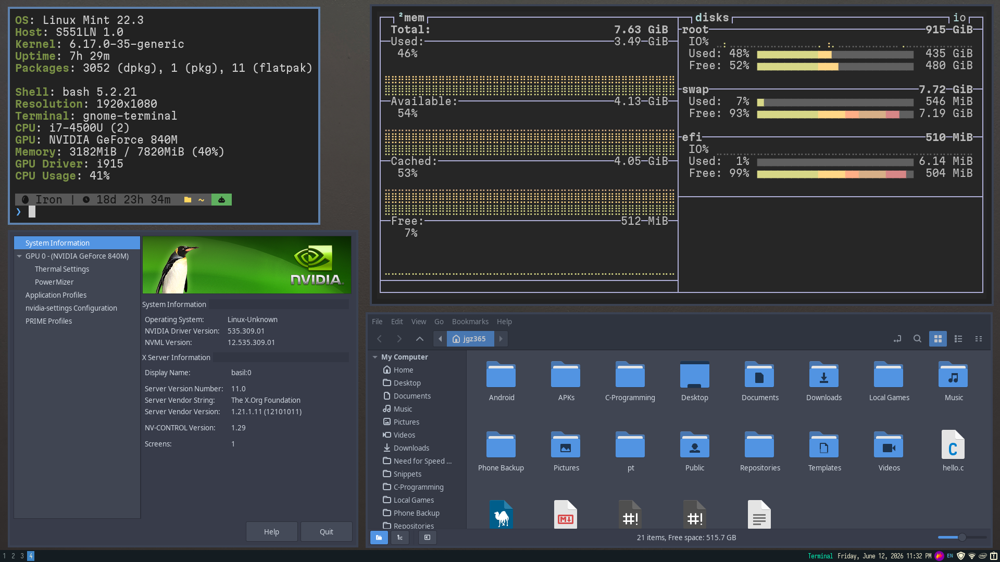
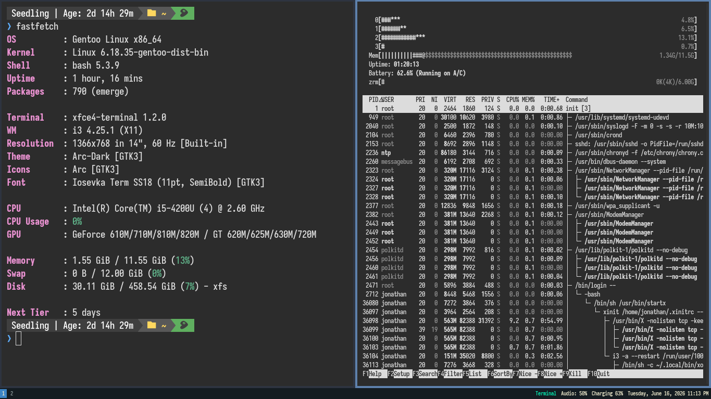

## My personal set of configurations for linux-related stuff.

<table border="0">
  <tr>
    <td align="center">
       
      <b>Linux Mint with i3wm on 1920x1080 </b>
    </td>
    <td align="center">
       
      <b>Gentoo Linux with i3wm on 1366x768 </b>
    </td>
  </tr>
</table>

# I've listed some documentation or things that I have used on their respective folders. Check here for [epoch](./epoch) and [deborah](./deborah)

## Programs/tools/utilities that I use:

### For both (as the setup is identical)

- [Iosevka](https://github.com/be5invis/iosevka), [Geist](https://github.com/vercel/geist-font), [Martian](https://github.com/evilmartians/mono) - nerd fonts, mostly bold-tainted, better readability in my case
- [superfile](https://github.com/yorukot/superfile)
- i3status with [window title](https://github.com/rholder/i3status-title-on-bar)
- [Flameshot](https://flameshot.org/) - screenshot tool, flexible
- [j4-dmenu-desktop](https://github.com/enkore/j4-dmenu-desktop) - better dmenu for app launcher
- *B*ourne *A*gain *Sh*ell - with custom prompt
- [Gogh](https://gogh-co.github.io/Gogh/) - for terminal theme
 
### For Linux Mint:

- [Brave Origin](https://brave.com/origin/)
  > Free on Linux
- Cinnamon's Terminal

### For Gentoo Linux:

- Firefox
- XFCE Terminal
- [xob](https://github.com/florentc/xob) - overlay bar for brightness/audio
  
  This theme heavily uses the [Arc Theme](https://github.com/arc-design/arc-theme), same goes to the terminal theme.

> The "unmaintained" folder is my archived folder, it hasn't been used for a while so they may or may not work.

Sources used:
- [i3-starterpack](https://github.com/addy-dclxvi/i3-starterpack)
- [C. Pissarro Artworks](https://www.wikiart.org/en/camille-pissarro)
- [Gentoo Wiki - i3wm](https://wiki.gentoo.org/wiki/I3)
- [Debian Packages](https://www.debian.org/distrib/packages)
- [NVIDIA Graphics Drivers](https://wiki.debian.org/NvidiaGraphicsDrivers)
- [This stackoverflow question](https://stackoverflow.com/questions/40986340/how-to-wget-a-list-of-urls-in-a-text-file)
- [CTT's Debian-titus script](https://github.com/ChrisTitusTech/Debian-titus/blob/main/install.sh)
- [Bash Git Prompt](https://github.com/magicmonty/bash-git-prompt)
- [Bash Syntax](https://www.w3schools.com/bash/bash_syntax.php)
- [Fastfetch](https://github.com/fastfetch-cli/fastfetch)
- [Arc-Theme](https://github.com/arc-design/arc-theme)
